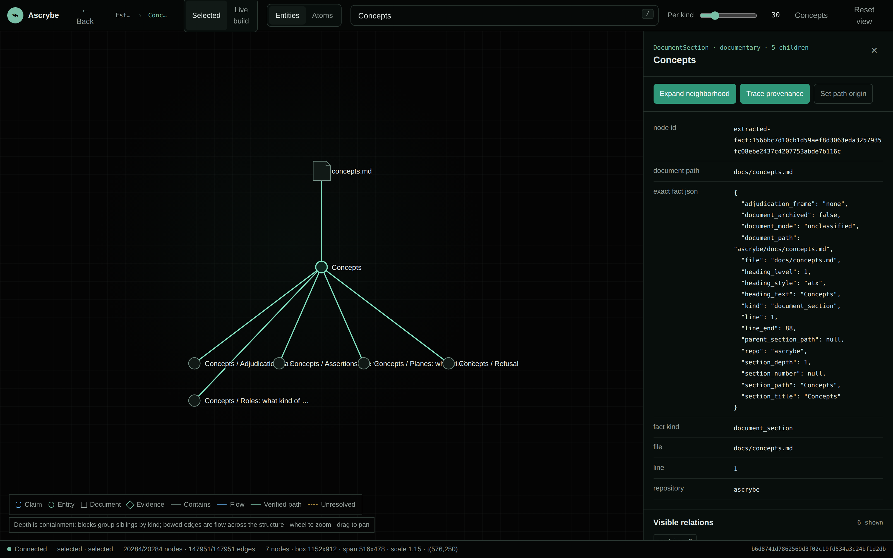

# Affinity Scrybe (ascrybe)

**Turns your repo into a graph — for you and your agents.**

*Affinity* — alchemy's word for which substances take to which.
*Scry* — to read what cannot be seen directly.

---



*Ascrybe mapping its own repository: a document, the sections inside it, and the exact
extracted fact behind the selected one — its file, its line, and the frame in which it could be
refuted.*

Ascrybe maps a software estate into a queryable graph and keeps two things apart that most tools
merge: what a deterministic extractor **observed** in the code, and what a document **claims**
about it. Both are in the graph. Neither is allowed to stand in for the other, because the
interesting question is usually whether they agree.

To ascribe is to attribute a statement to its source. That is the whole product: every assertion
carries the document, the line, the section, the producer that made it, and the frame in which it
could be refuted — and where no warrant exists, Ascrybe refuses rather than guesses.

## What you get

```bash
ascrybe query overview                    # the estate, ranked by structure
ascrybe query node --id doc:design/X.md   # a document, its sections, its claims
ascrybe query provenance --id <claim>     # what justifies this, and how
ascrybe cypher --query '...'              # bounded, read-only, projection-scoped
```

Plus a graph dashboard, and a packaged read-only bundle an agent can install.

## The model, briefly

Nodes sit in one of four **planes** — `entity`, `observation`, `documentary`, `adjudication` —
which say what would have to be true for the node to be wrong. Relations carry one of three
**roles** — `structural`, `flow`, `annotation` — which is what lets a bounded view show shape
instead of a hairball.

An **assertion** carries a subject, a source, and a nature: who produced it, whether it prescribes
or describes, and its **adjudication frame** — `code`, `execution`, `world`, `external_system`, or
`none`. `none` is not a classification failure. It means nothing could refute the document, which
is a finding, and it is how Ascrybe decides what is worth paying a model to read.

Grounding never rewrites an assertion. If a document says `OrderSvc` and the estate calls it
`order-service`, the verbatim identifier survives forever and the resolution is a separate,
receipted record.

See [docs/concepts.md](docs/concepts.md).

## Getting started

```bash
git clone <this repository> && cd ascrybe
npm run setup
cp ascrybe.env.example .env
cp ascrybe.config.example.json ascrybe.config.json
# edit the machine-local config, then:
node scripts/test-fast.mjs        # hermetic: no secret, no database, no model call
ascrybe --help                    # every verb
```

The battery is hermetic: no secret, no database, no model call. Generated state, `.env` and the
runtime config live outside Git by design.

## Documentation

Two doors. **[USAGE.md](USAGE.md)** to map an estate and read it — the default.
**[CONTRIBUTING.md](CONTRIBUTING.md)** to change Ascrybe itself. That is the same line the command
surface draws: `ascrybe <verb>` acts on an estate, `npm run <script>` acts on Ascrybe.

| | |
|---|---|
| [usage](USAGE.md) | install, map, query, package — start here |
| [contributing](CONTRIBUTING.md) | invariants, gates, PR discipline — only when changing the platform |
| [concepts](docs/concepts.md) | planes, roles, assertions, adjudication frames, refusal |
| [architecture](docs/architecture.md) | the five stages, what each costs, generations and promotion |
| [query surface](docs/query-surface.md) | both read boundaries, bounded views, the contract |
| [operating](docs/operating.md) | configuration, staging, promotion, cost control |
| [evaluation](docs/evaluation.md) | the harness, and what it does **not** measure |
| [verification](docs/verification.md) | the gates, and why a check that never ran is the worst kind |
| [before a PR](docs/before-a-pr.md) | proving a fix with a number the bug could not produce |
| [releasing](docs/releasing.md) | what a release promises, and how each promise is proved |

## Status

Working and in use on a real estate; not yet packaged for general installation. The evaluation
harness has a ceiling that [docs/evaluation.md](docs/evaluation.md) states plainly rather than
leaving to be discovered. The query surface contract is versioned and digest-checked, so a client
can tell when this documentation has drifted from the build.

## Licence

Apache 2.0. See [LICENSE](LICENSE) and [NOTICE](NOTICE).
