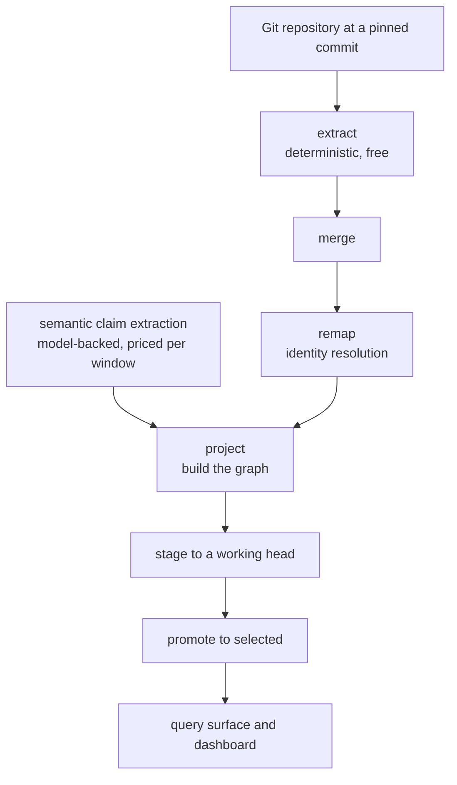

# Architecture

Five stages turn a checkout into a queryable graph. Each writes an artifact with a digest, and
each stage validates the digest it was handed, so a projection can never be built from mismatched
inputs.

## What each stage costs

| stage | cost | time on a 1,154-document estate |
|---|---|---|
| extract, merge, remap | free, deterministic | ~4 minutes |
| semantic claim extraction | **priced per window** | hours |
| project | free | ~9 minutes for 630k nodes |
| stage and promote | free | included above |

Only one stage costs money. That is why the pipeline is split here rather than run end to end: the
free half can be re-run freely, and a projection can be rebuilt from an existing claim map without
paying again.

## Source identity

A single-repository estate names its commit directly. A multi-repository estate has no single
commit, so it pins one per repository and the ordered map's digest becomes the estate's identity.
The two forms are distinguished by which field the artifact carries, never inferred.

This matters more than it sounds. A fact records its path relative to **its own repository**, while
a document is addressed relative to **the estate**. Those coincide only when the estate is one
repository rooted at the estate root — which is why a join that looked total in a single-repo
estate was accidental, and why facts now carry their own document address.

## Generations

A projection is immutable and identified by the digest of its content. Building the same inputs
with the same code produces the same `projection_id`; changing either produces a different one.

Two heads per estate:

- `working` — where a new generation is staged
- `selected` — what the query surface and dashboard serve

Promotion is a compare-and-set against the expected current head, so a concurrent promote fails
loudly rather than silently winning. Retention keeps the selected generation and one predecessor;
older ones are **regenerable, not recoverable**.

One consequence worth stating plainly: if digest-bearing code changes between staging and
promoting, the staged generation is no longer what the current commit produces. Promoting it
anyway leaves a served graph that nobody can rebuild from a checkout.

## Estates in one database

Every estate lives in the same Neo4j. Rows are isolated by `projection_id`; the only shared name
was the head slot, so heads are addressed per estate (`<estate>:selected`). Retention is scoped to
one estate **and** protects every head in the database, because the first version scoped only the
read and would have deleted another estate's graph.

## The read surface

Two boundaries over the same projection, and nothing reaches past them:

- a **closed command set** returning machine-readable affordances, for guided traversal
- a **bounded Cypher gateway** that refuses writes, refuses procedures, and requires every
  `EstateNode` pattern to scope to `$projection_id`

Both are read-only by construction rather than by convention: the packaged bundle is built from
the transitive import closure of those two entry points, and the build fails if that closure ever
reaches a module that can stage or promote a generation.
