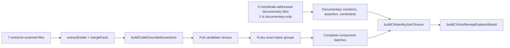

# C4 tracked mini-corpus

**Bottom line:** eight tracked source files drive the real extraction, identity, batching, and explorer producers with hand-authored coordinate expectations; this fixture proves correctness mechanics, not full-estate coverage.



## Inventory

| Surface | Exact fixture inventory |
|---|---:|
| Tracked estate files | 8 |
| Extractor-scanned files | 7: 5 YAML + 2 SQL |
| Documentary-only files | 1 Markdown |
| Estate components | 3: `code`, `design`, `docs` |
| Extracted facts | 22 across 7 kinds |
| Identity candidates | 12 in 10 exact-basis components |
| Batch configuration | 6 candidates, approximate at component boundaries |

`documentary-substrate.json` names source path, line, surface, role, assertion binding, and expected outcome. Tests derive evidence and mention IDs through production builders; opaque hashes are never expected-value oracles.

## Expected semantics

| Case | Hand-authored expectation |
|---|---|
| Three `urn:mini:shared` YAML declarations | 3 joined receipts, one component, one shared Referent |
| Four `same_name` SQL/SQLite declarations | 4 unresolved receipts in 4 namespace-distinct components |
| `urn:mini:orphan` | unresolved: no documentary occurrence |
| Source-cited alias + exact definition | 3 documentary mentions resolve together |
| `urn:mini:blocked` + explicit distinction | 1 `cannot_link` through transitive whole-component validation |
| All-mode partition | 3 joined, 8 unresolved, 1 cannot-link, 0 terminal-incomplete |
| Adjacent batches | disjoint; complete-component union equals all 12 candidates and all 10 components |
| Deferred candidates | `not_evaluated_in_this_batch`; no semantic disposition |
| Repeated run | complete code-plane, closure, batch, and explorer models are byte-equal |

## Fast proof

```bash
node --test tests/c4-mini-corpus.test.mjs tests/extraction-cache-mini-fixture.test.mjs
```

The suite runs on the default small Node process, uses managed scratch, and completes in under one second on the recorded host. It performs no network access, ignored-asset read, historical Git-object read, global `/tmp` cache, or large-heap allocation.

| Proved here | Full-corpus-only evidence |
|---|---|
| Real extractor/merge/adapter path; generator; exact grouping; unchanged admissibility and four semantic dispositions; complete-component batching; pending state; adjacent cursor progression; explorer model; deterministic replay; content-bound cache invalidation | 70,904-fact inventory; 397-candidate denominator; 7,540 documentary assertions; 8,024 receipts; documentary digest/histogram; 289-page atlas; combined graph totals; full-estate runtime and peak RSS |
